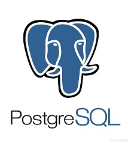

> [!IMPORTANT]
> **This repository is archived and no longer maintained or supported.**
>
> - **Archived:** 2026-10-06
> - **Reason:** AppMon product EOL
> - **Replacement:** None
>
> Preserved for historical and migration reference only. No updates, including security updates, will be provided.
> See the [Dynatrace Archive organization README](https://github.com/Dynatrace-Archive) for usage and security guidance.

## PostgreSQL Monitor Plugin

PostgreSQL monitor Plugin allows you to monitor the values in key statistics PostgreSQL database. All captured data are provided by dynaTrace as Measures, enabling the assembly of its database monitoring dashboards. You can view statistics tables, database activities, I / O, Indexes, Sequences, and Cache Hit Rate and Usage Index.

Find further information in the [dynaTrace community](https://community.dynatrace.com/community/display/DL/PostgreSQL+Monitor+Plugin)
 
